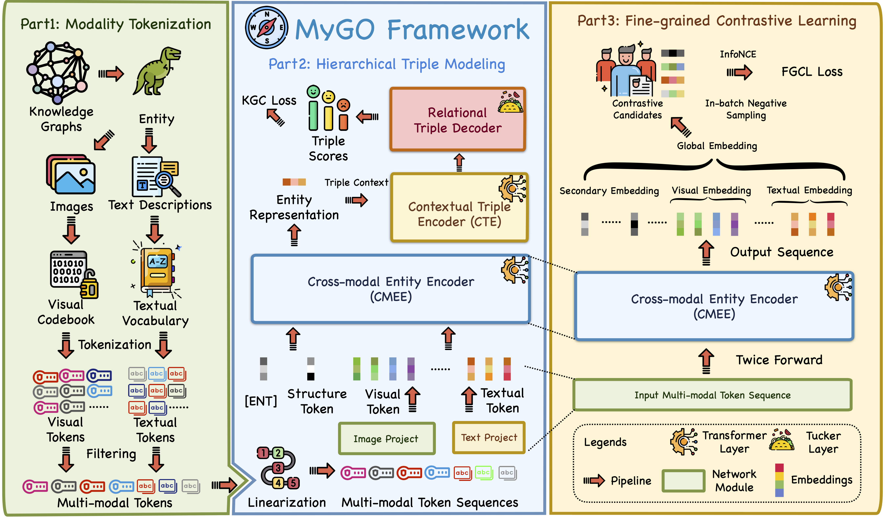

# (MyGO) Tokenization, Fusion, and Augmentation: Towards Fine-grained Multi-modal Entity Representation


## Overview


## 🎆 News
- `2024-12` 🎉🎉🎉 Our paper is accepted by AAAI 2025. The title is changed to **Tokenization, Fusion, and Augmentation: Towards Fine-grained Multi-modal Entity Representation**.
- `2024-04` Our paper and code are released on ArXiV and Github.
- `2024-02` **We preprint our Survey [Knowledge Graphs Meet Multi-Modal Learning: A Comprehensive Survey](http://arxiv.org/abs/2402.05391)  [[`Repo`](https://github.com/zjukg/KG-MM-Survey)].**


## Dependencies
```bash
pip install -r requirement.txt
```

#### Details
- Python==3.9
- numpy==1.24.2
- scikit_learn==1.2.2
- torch==2.0.0
- tqdm==4.64.1
- transformers==4.28.0


## Data Preparation
You should first get the textual token embedding by running `save_token_embeddings.py` with transformers library (BERT, RoBERTa, LlaMA). You can first try MyGO on the pre-processed datasets DB15K, MKG-W, and MKG-Y. The large token files in `tokens/` should be unzipped before using in the training process. We provide VQGAN / BEiT tokens for visual modality and BERT / RoBERTa / LlaMA tokens for textual modality.

## Train and Evaluation
You can refer to the training scripts in `run.sh` to reproduce our experiment results. Here is an example for DB15K dataset.

```bash
CUDA_VISIBLE_DEVICES=0 nohup python train_mygo_fgc.py --data DB15K --num_epoch 1500 --hidden_dim 1024 --lr 1e-3 --dim 256 --max_vis_token 8 --max_txt_token 4 --num_head 2 --emb_dropout 0.6 --vis_dropout 0.3 --txt_dropout 0.1 --num_layer_dec 1 --mu 0.01 > log.txt &
```

More training scripts can be found in `run.sh`.

## How to Conduct Multi-image Experiments?
- In the provided token files, the number of visual tokens is a multiple of 196 (196, 392, 588, 784, 960). This pattern occurs because BEiT processes each image into 196 tokens, so each entity with N images will have N*196 visual tokens. We can perform the multi-image experiments mentioned in the paper by dividing the entity's visual tokens into groups of every 196, in order, and then generating entity token files with different number of images.

## 🤝 Citation
```bigquery

@inproceedings{DBLP:conf/aaai/ZhangCGXHLZC25,
  author       = {Yichi Zhang and
                  Zhuo Chen and
                  Lingbing Guo and
                  Yajing Xu and
                  Binbin Hu and
                  Ziqi Liu and
                  Wen Zhang and
                  Huajun Chen},
  title        = {Tokenization, Fusion, and Augmentation: Towards Fine-grained Multi-modal
                  Entity Representation},
  booktitle    = {{AAAI}},
  pages        = {13322--13330},
  publisher    = {{AAAI} Press},
  year         = {2025}
}

```